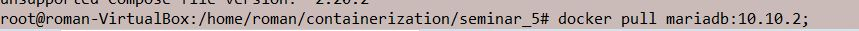
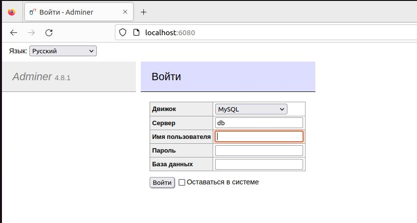
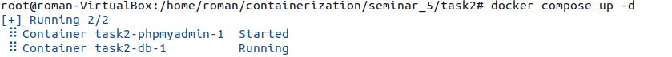
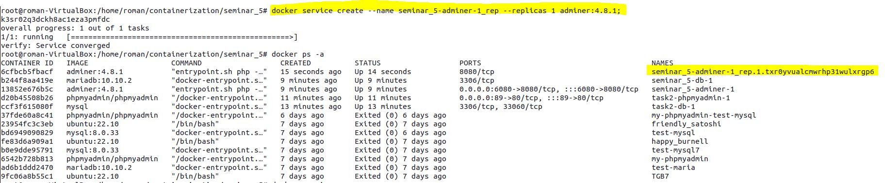
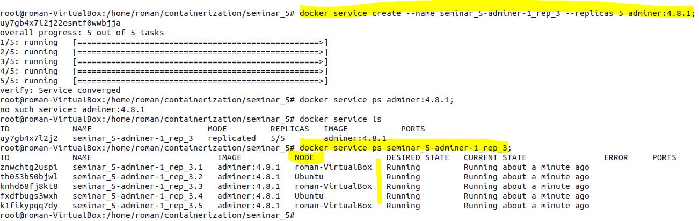

**Первый вариант решение
Создаем два ДК-файла:

Компилируем node:

Проверяем:

Пытаемся задеплоить в Stack:

Получаем ошибку: "версия данного файла не поддерживается", продолжаем делать, как на семинаре.
Запускаем первый ДК-файл:

Проверяем:

Запускаем второй ДК-файл:

Воспользуемся функционалом Docker Swarm и создадим дубликат одного и того же образа:

Аналогично можем проделать с другими образами, далее повязать их сетью и получить полные дубликаты: БД + WEB.

**Второй вариант решение(с использованием второй node):**

Подключаемся по SSH ко второй VM и устанавливаем swarm соединение, предварительно инициализировав manager node:

Запускаем первый ДК-файл на manager node:

Проверяем:

Запускаем второй ДК-файл на worker node:

Проверяем:

Попробуем запустить первый ДК-файл на node worker:

Проверяем, все работает, ошибки дублирования не произошло т. к имена image разные(ДК-файлы в разных директориях 
находятся на VM)

Запускаем на manager node второй ДК-файл и получаем четыре работающих контейнера на одной node и на другой
(не считая hello-word):

Если бы расположение папок было идентично на manager node и worker node, пришлось бы создавать реплики образов и 
обвязывать их сетью:

Тем временем наблюдаем за статусом worker node, он "упал"(Отказался идти на повышение). Переподключаем swarm соединение:

Создаем еще реплики образов и видим как система их перераспределяет:

*Подготовил студент GeekBrains* [**`Nikita Mashkin**]
